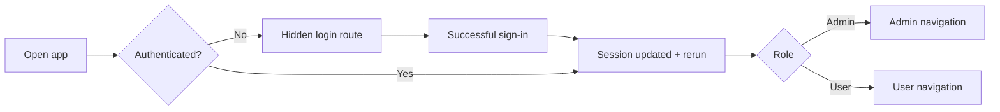
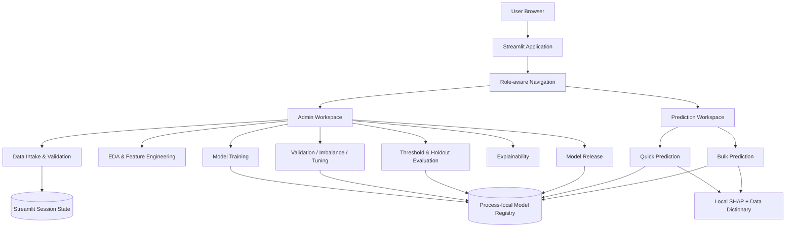
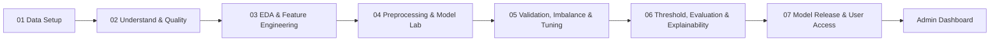
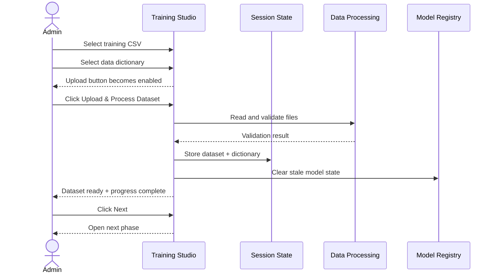
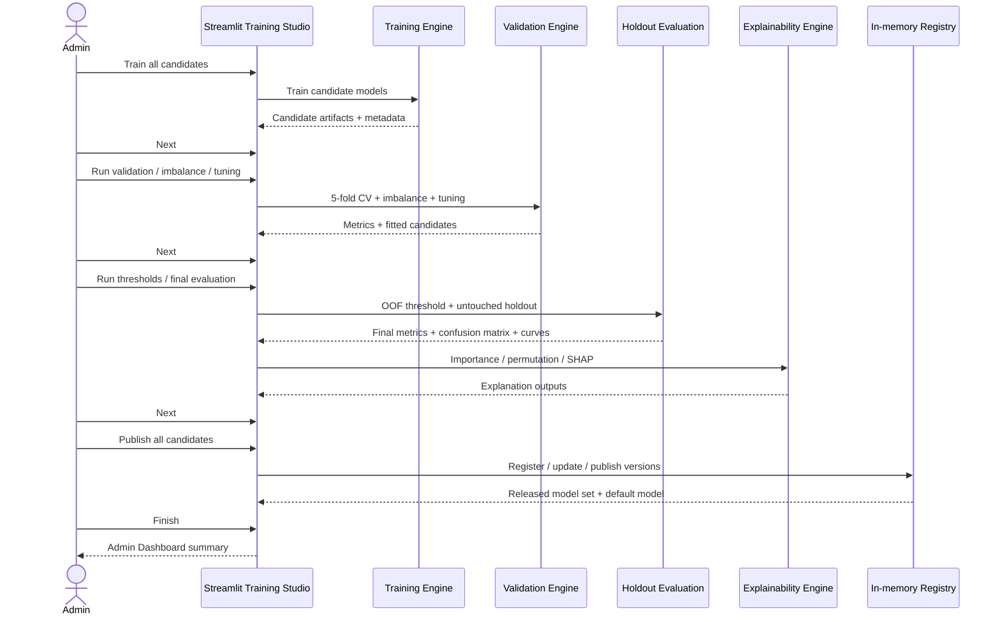
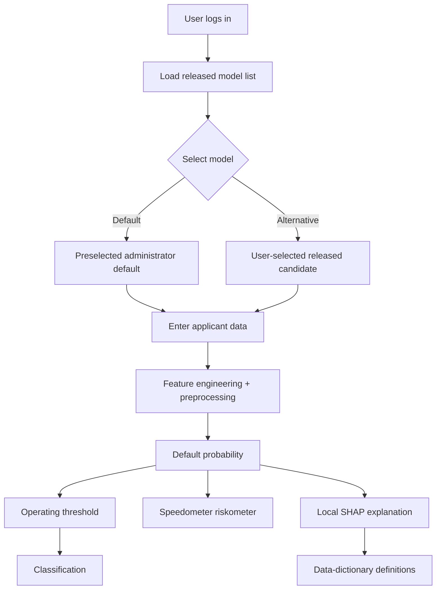
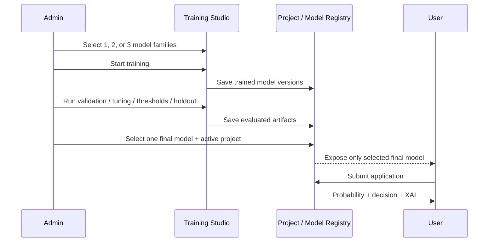
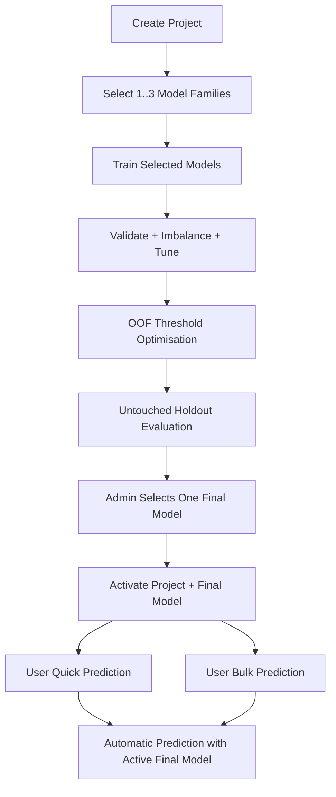
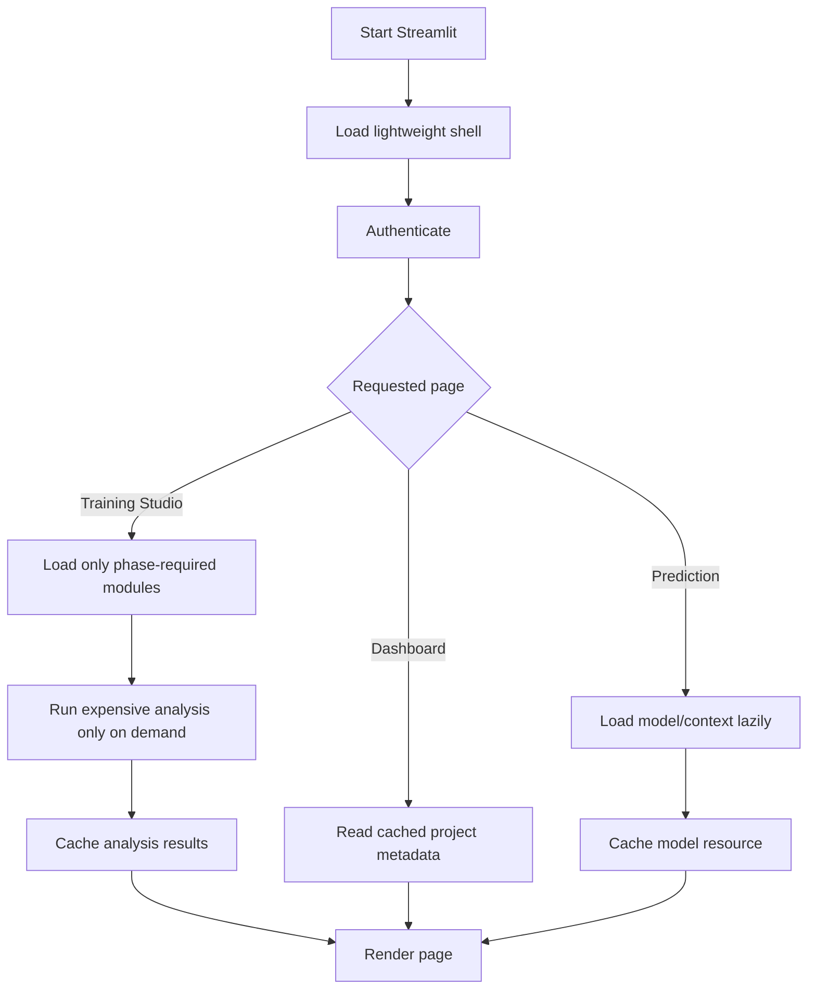
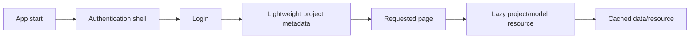

# CreditRisk Studio

Current release: **v6.8 Performance Pass**.

CreditRisk Studio is a Streamlit-only academic automobile-loan default analytics product. It provides an end-to-end workflow for dataset intake, exploratory analysis, feature engineering, model development, validation, threshold selection, explainability, model release, and interactive prediction.

The application is intentionally self-contained for an academic/local deployment: interactive workflow state is kept in Streamlit session state, while trained projects, source datasets, model artifacts, analysis outputs and run logs are persisted locally under the `projects/` directory. An in-process registry/cache is hydrated from that local project library at startup. There is no FastAPI service, database, Redis queue, MLflow server, or external object store in this build.

## Runtime logging and troubleshooting

Prediction, bulk-scoring, training, and application lifecycle events are logged at `DEBUG`, `INFO`, `WARNING`, and `ERROR` levels. Workflow pages expose a collapsed terminal-style console for the relevant channel, while the full Python traceback is also printed to the Streamlit server terminal for development troubleshooting. User-facing error messages contain the exception type and message without replacing the diagnostic console.

For a quick prediction failure, expand **Prediction console** after the attempt. For a bulk failure, expand **Bulk prediction console**. Long-running training activity remains in **Processing console**.


## Session isolation and logout

Logout is treated as an authentication boundary. The application clears the entire Streamlit session state before rerunning the unauthenticated login route. This removes Quick Prediction results, Bulk Prediction results, processing logs, workflow state, selections and other transient role-specific data. Persistent Projects, datasets, model artifacts and release metadata remain on disk and are not deleted by logout.

The application also delays creation of the filesystem-backed model/project registry until after authentication. The unauthenticated login path therefore does not hydrate project/model metadata unnecessarily, which keeps logout and subsequent login transitions lightweight.

Prediction pages apply an additional owner/role/project guard before rendering cached session results, so a stale prediction object cannot be displayed under a different authenticated context even if it somehow remains in session state.

## Product goals

- Keep the application empty at startup: no preloaded dataset, model, metrics, or predictions.
- Make model training explicit and observable.
- Process the candidate models through the same governed workflow.
- Let an administrator review evidence before releasing models.
- Use one administrator-selected final model for User prediction within the active project.
- Keep prediction explanations tied to actual model evidence and data-dictionary definitions.
- Keep the UI clean while making analytical detail available through collapsed sections.

## Authentication and navigation

The application uses role-aware dynamic navigation. Before authentication, the browser is routed to a hidden single-page sign-in entry point, so the authenticated sidebar menu is not exposed. After a successful login, the app reruns and creates the role-appropriate navigation for Admin or User.



The unauthenticated screen intentionally has no visible sidebar navigation. Authenticated pages are only registered in the active navigation set after the user is known.

The sign-in callable page is explicitly declared as the default page (`default=True`) and uses a hidden navigation position. This keeps the login route at the root path without supplying an empty `url_path`, which is required by Streamlit for non-default pages.

## High-level architecture



### Runtime architecture

```text
                         CreditRisk Studio

                 ┌──────────────────────────┐
                 │      Streamlit UI        │
                 │  Pages + Components      │
                 └────────────┬─────────────┘
                              │
                 ┌────────────▼─────────────┐
                 │      Session / State      │
                 │ workflow + busy + logs   │
                 └────────────┬─────────────┘
                              │
          ┌───────────────────┼───────────────────┐
          │                   │                   │
          ▼                   ▼                   ▼
   Data / EDA layer     Training layer      Prediction layer
          │                   │                   │
          └──────────────┬────┴───────┬───────────┘
                         ▼            ▼
                 Cached calculations  Model registry
                         │            │
                         └──────┬─────┘
                                ▼
                       Model artifacts / metadata
```

## End-to-end workflow

The training studio intentionally compresses the analysis into seven user-facing phases while retaining the analytical stages inside each phase. The administrator advances with **Next**; completing a long-running action never jumps the workflow automatically.



### Phase responsibilities

| Phase | Purpose | Main outputs |
|---|---|---|
| 01 Data Setup | Select and process training dataset + dictionary | Validated dataset in session |
| 02 Understand & Quality | Inspect target, schema, missingness, constants and semantic types | Data-quality views |
| 03 EDA & Feature Engineering | Explore distributions, group default rates, correlations and engineered variables | EDA figures and engineered matrix |
| 04 Preprocessing & Model Lab | Build preprocessing and train all candidate models | Candidate model bundle |
| 05 Validation, Imbalance & Tuning | Compare cross-validation behaviour, class weighting and tuned configurations | CV / imbalance / tuning results |
| 06 Threshold, Evaluation & Explainability | Generate OOF thresholds, evaluate holdout, calculate model explanations | Final metrics, thresholds, XAI |
| 07 Model Release & User Access | Publish candidate versions and designate the default | User-visible model registry |

## Training transaction

Data Setup uses a two-step interaction: selecting files does not process anything; the administrator must explicitly press **Upload & Process Dataset**. This avoids accidental dataset changes and makes the transaction visible.



## Model training and release sequence



## User prediction flow



## Prediction safety and interpretation

The prediction screen separates three concepts: the model-estimated probability, the visual probability band, and the model's operating threshold. The visual riskometer is a communication aid, not a regulatory or legal credit rating.

The explanation panel distinguishes model contribution from causation and shows which raw inputs were supplied versus defaulted/assumed in simplified Quick Prediction mode.

## Caching and execution model

### Cached work

- `st.cache_data` is used for repeatable data parsing, understanding calculations and EDA computations.
- `st.cache_resource` is used for loaded model resources.
- Heavy ML libraries are imported lazily where practical.

### Long-running work

Training, validation, tuning, threshold generation, permutation importance and SHAP are explicitly triggered. While one operation is running, related controls are disabled and progress/status/logging are shown.

This build deliberately avoids background threads for model training because Streamlit session state and the in-process model cache are shared mutable state. Serialized foreground execution with explicit busy-state protection is simpler and safer for this academic application.

## Processing console

The Training Studio includes a collapsed terminal-style console. It is intentionally dark and monospace so administrators can distinguish processing output from normal application content.

Example:

```text
[15:42:11] Phase 04 started: training candidate models
[15:42:12] Prepared modelling matrix
[15:42:12] Training Random Forest...
[15:42:18] Completed Random Forest
[15:42:18] Training XGBoost...
[15:42:26] Completed XGBoost
[15:42:26] Training L1 Logistic...
[15:42:29] Completed L1 Logistic
[15:42:29] Phase 04 complete
```


## Recent UX refinements

The current build includes several interaction details intended to keep the workflow predictable and uncluttered:

- After **Create & Process Project** succeeds, Phase 01 immediately refreshes the in-page dataset summary and preview in the same interaction cycle; the administrator does not need to leave and re-enter the phase.
- The Training Studio processing console is always rendered as a dark terminal-style panel with a grey-black background and light monospace text. It is collapsed by default.
- **Model Results** contains only published/default model versions. Candidate-only versions remain visible in the training/model-release workflow and in Model Versions for administration, but they are not presented as final results.
- The Admin Dashboard uses a compact horizontal workspace context strip for administrator role, User-facing project, and default model. The authenticated sidebar keeps only compact context so it does not consume the main vertical workspace.
- Expensive operations remain explicit. The UI uses busy-state protection and progress/status feedback rather than unnecessary background threads.

### Empty-to-published lifecycle

The product starts with no training results. A typical lifecycle is:

```text
No project
   ↓
Create & Process Project
   ↓
Dataset preview + analytical phases
   ↓
Train candidates
   ↓
Validate / tune / threshold / evaluate
   ↓
Publish models
   ↓
Model Results = published models only
   ↓
Admin Dashboard = project summary
   ↓
User Prediction = active project's published models
```

## Project structure

```text
creditrisk_studio/
├── app.py
├── requirements.txt
├── README.md
├── END_TO_END_STATUS.md
├── .gitignore
│
├── .streamlit/
│   ├── config.toml
│   └── secrets.toml.example
│
├── components/
│   └── ui.py
│
├── core/
│   ├── analysis_cache.py
│   ├── auth.py
│   ├── ml_runtime.py
│   ├── session.py
│   └── state.py
│
├── ml/
│   ├── eda.py
│   ├── evaluation.py
│   ├── explainability.py
│   ├── feature_engineering.py
│   ├── models.py
│   ├── preprocessing.py
│   ├── schema.py
│   └── training.py
│
├── pages/
│   ├── about.py
│   ├── bulk_prediction.py
│   ├── explainability.py
│   ├── home.py
│   ├── model_results.py
│   ├── model_versions.py
│   ├── run_history.py
│   ├── training_studio.py
│   └── user_prediction.py
│
├── artifacts/
│   └── model/
│       ├── candidates/
│       └── final/
│
├── data/
│   └── README.txt
│
└── tests/
    ├── test_feature_engineering.py
    ├── test_product_state.py
    └── __init__.py
```

### Package responsibilities

| Area | Responsibility |
|---|---|
| `pages/` | Thin Streamlit presentation and user interaction code |
| `ml/` | Reusable ML logic: feature engineering, preprocessing, training, evaluation and XAI |
| `core/` | Authentication, session state, caching, project persistence and model registry |
| `components/` | Shared visual/UI helpers |
| `projects/` | Persistent project library: source data, models, analysis outputs, runs and release metadata |
| `artifacts/` | Reserved compatibility directory; the app writes project artifacts under `projects/` |
| `tests/` | Regression and state/feature tests |

## Libraries

The current environment is pinned for Windows + Python 3.13.x.

| Library | Version | Purpose |
|---|---:|---|
| Streamlit | 1.64.0 | Web application and UI |
| pandas | 2.3.3 | Data manipulation |
| NumPy | 2.3.4 | Numerical operations |
| SciPy | 1.16.2 | Statistical utilities |
| scikit-learn | 1.7.2 | Preprocessing, modelling and evaluation |
| XGBoost | 3.4.1 | Gradient-boosting candidate model |
| SHAP | 0.52.0 | Local/global model explanations |
| Plotly | 6.8.0 | Interactive charts |
| openpyxl | 3.1.5 | Excel read/write |
| xlrd | 2.0.2 | XLS input support |
| joblib | 1.5.2 | Model/resource serialization |
| pytest | 8.x | Automated tests |

## Persistent project library

A project is the durable unit of work. Each named project gets a unique folder so that a new training run does not overwrite an earlier project.

```text
projects/
├── project_index.json
├── <project-slug>__<project-id>/
│   ├── project.json
│   ├── data/
│   │   ├── <training dataset>
│   │   └── <data dictionary>
│   ├── models/
│   │   ├── candidates/
│   │   │   ├── candidate-*.joblib
│   │   │   └── candidate-*.json
│   │   ├── releases/
│   │   │   ├── release-*.joblib
│   │   │   └── release-*.json
│   │   └── model_index.json
│   ├── analysis/
│   │   ├── cross_validation_results.csv
│   │   ├── cross_validation_folds.csv
│   │   ├── imbalance_comparison.csv
│   │   ├── threshold_summary.csv
│   │   └── final_metrics.csv
│   ├── runs/
│   │   └── <run-id>/
│   │       ├── run.json
│   │       └── console.log
│   └── exports/
```

### Project lifecycle

1. Admin enters a project name and selects a training dataset + data dictionary.
2. **Create & Process Project** creates the project folder and copies the source files.
3. The training workflow writes candidate and release artifacts into that same project.
4. Publishing a project marks one model as the default and makes the whole project active for Users.
5. Only models belonging to the active User-facing project are exposed in Quick Prediction and Bulk Prediction.
6. Previous projects remain available to the Admin for review and can later be made active again.

### Naming and overwrite behaviour

Project folder names are slugified for portability and include a unique project ID. This means two projects can have the same human-friendly name without overwriting one another. Model version IDs also include timestamps and a short unique suffix.

## Installation runbook

### 1. Open PowerShell

From the project directory:

```powershell
python --version
```

The target environment is Python 3.13.x.

### 2. Create the virtual environment

```powershell
python -m venv .venv
.\.venv\Scripts\Activate.ps1
```

Verify that the active interpreter is inside `.venv`:

```powershell
python --version
python -c "import sys; print(sys.executable)"
python -m pip --version
```

### 3. Install dependencies

```powershell
python -m pip install --upgrade pip
python -m pip install -r requirements.txt
```

### 4. Configure demo authentication

```powershell
copy .streamlit\secrets.toml.example .streamlit\secrets.toml
```

Demo credentials are for local academic use only. Do not commit `secrets.toml`.

### 5. Start the application

```powershell
streamlit run app.py
```

## Application runbook

### Administrator

1. Log in as `ADMIN`.
2. Open **Training Studio**.
3. In **01 Data Setup**, select the training CSV and data dictionary.
4. Click **Upload & Process Dataset**.
5. Use **Next** to move through each phase.
6. In Model Lab, train all configured candidate models.
7. In Validation, Imbalance & Tuning, run the long-running analysis.
8. In Threshold, Evaluation & Explainability, generate OOF thresholds, holdout metrics and explanations.
9. In Model Release & User Access, publish the candidates and designate the default model.
10. Finish the workflow to return to the Admin Dashboard.

### User

1. Log in as `USER`.
2. Choose a released model; the administrator default is preselected.
3. Enter Quick Prediction inputs or upload a bulk file.
4. Review probability, riskometer, threshold decision and explanation.
5. Download bulk results when required.

## Operational rules

### Dataset replacement

After the administrator leaves Data Setup, the dataset is locked for that run. **Change dataset** clears downstream training, validation, threshold and release state before another dataset can be processed.

### Holdout boundary

The holdout/test partition is reserved for final evaluation and is not used for cross-validation or threshold selection.

### Model release

Publishing synchronizes candidate artifacts into the project registry, verifies that versions exist, marks the selected default model, and sets the entire project as the active User-facing project.

### Restart behaviour

Project metadata, source datasets, model artifacts, analysis CSVs and run logs are persisted under `projects/` and reloaded when Streamlit restarts. Interactive workflow state such as the current phase and unsaved page controls remains session-local by design. The local project library is suitable for the academic application but is not an enterprise multi-user registry.

## Runtime alias safety

Visualization and numerical aliases used by page renderers are imported at module scope for the page that owns them. This avoids failures where a conditional/lazy import is skipped but a later chart still references the alias. The affected pages include Training Studio (`px`), Bulk Prediction (`px`), and Quick Prediction (`np`).

## Troubleshooting

### `python` shows the wrong Python version after activation

A virtual environment uses the Python installation that created it. Delete and recreate `.venv` with the correct system Python:

```powershell
deactivate
Remove-Item -Recurse -Force .venv
python --version
python -m venv .venv
.\.venv\Scripts\Activate.ps1
python --version
```

### Upload button is disabled after selecting files

The file uploaders are intentionally outside a Streamlit form. This allows the page to rerun when files change and re-evaluate the button state. Both the training dataset and dictionary must be selected before the transaction button becomes active.

### A long-running action looks frozen

Open the **Processing console** at the bottom of the page. The action also shows a status/progress area while running. Controls for overlapping work are disabled during processing.

### Results disappear after restarting Streamlit

The runtime registry is hydrated from the local `projects/` directory at startup. Check that the project folder and `project_index.json` still exist and that the model artifact paths in the project model index are intact.

## Testing

Run:

```powershell
python -m pytest -q
```

Also run a syntax/compile check when modifying the project:

```powershell
python -m compileall .
```

## Design principles

- Streamlit-first UI using native widgets.
- Explicit user actions for expensive work.
- No automatic training on startup.
- No hidden dataset/model defaults.
- No unnecessary asynchronous threads in the Streamlit-only build.
- Thin page code with reusable ML modules.
- Data dictionary definitions are reused in explanations.
- Model explanations describe evidence used by the model; they do not claim causation.
- Expanders are collapsed by default to keep the interface clean.
- Busy-state protection prevents accidental duplicate long-running operations.

## Future extensions

The current build intentionally uses a local filesystem project library plus Streamlit session state. A future production architecture could later add a database-backed project registry, object storage, external model registry, background workers, stronger authentication, audit persistence and monitoring without changing the core ML interfaces.

## Bulk scoring type normalization

Bulk CSV/Excel files can carry the same business field using different physical types (for example, an application hour may be numeric in one file and text in another). Before feature engineering, the shared cleaning layer explicitly coerces numeric-as-text fields, credit amount, credit score source 3, and application-process hour to numeric values. This is important because the cyclical hour features use `sin`/`cos` and require a numeric input.

The row-detail table also renders mixed-type source values as display strings so Streamlit/Arrow receives a homogeneous display column; this is a presentation conversion only and does not change the values used for model scoring.


## Prediction input and explainability

Quick Prediction exposes a broader set of application inputs rather than relying only on a small seven-field demo. Core financial, household, profile and external-score fields are visible on the main form; additional credit, employment, contact and application signals are available in a collapsed advanced section.

The external score fields are genuine normalized source variables from the training data. They use the source scale `0–1`; this is not a percentage. The fields remain optional because the source data itself contains missing score values. When a score is unavailable, the standard model preprocessing/imputation strategy is used and the UI reports the field as assumed.

Local SHAP evidence is shown in two views: the full model-space evidence remains available to administrators, while the User prediction page aggregates encoded and engineered model features back to the raw application fields that the User actually supplied. Contributions that move the model output toward the default class are shown in red; contributions that move it away are shown in green. For engineered features that depend on several raw inputs, the signed contribution is split across those source inputs purely for presentation clarity; this is not a causal attribution.


## Final model governance

The system separates **training candidates** from the **final prediction model**. The Model Lab allows the administrator to train one, two, or all three supported model families. All selected models continue through the same validation, imbalance, threshold, holdout, and explainability lifecycle.

After evaluation, exactly one model is selected for User prediction. The administrator also selects which trained project is active. Users never choose a model in Quick Prediction or Bulk Prediction. The runtime resolves: `active project → administrator-selected final model → prediction`.

Other trained model versions remain persisted and visible to Admins for analysis/history, but they are not exposed to Users.




## Current workflow and release behavior

- Model Lab supports training **one, two, or all three** model families.
- The selected subset is carried through tuning, 5-fold validation, class-imbalance analysis, out-of-fold threshold selection, holdout evaluation, and explainability.
- The administrator selects **one final prediction model** after evaluation.
- The active configuration exposed to Users is **one project + one final model**.
- Users do not select a model in Quick Prediction or Bulk Prediction.
- Admin dashboard model tables show trained/evaluated model versions, not untrained candidate entries.
- The riskometer has three communication bands: Low, Medium, High. The operating threshold is shown separately from the risk band.



### Prediction diagnostics

Quick Prediction and Bulk Prediction each expose a collapsed terminal-style console for the most recent attempt. Entries are tagged `DEBUG`, `INFO`, `WARNING`, or `ERROR`. On exceptions, the UI receives a concise error summary and the Streamlit server terminal receives the full Python traceback for development diagnostics.

The raw-input SHAP aggregation API is called with keyword arguments to prevent dictionary/supplied-field argument-order errors. It also contains a compatibility guard for older positional callers.


## Performance and execution model

The application is designed for fast page navigation without sacrificing the analytical workflow.

- Application startup loads only authentication, lightweight project metadata and the Streamlit shell. It does not train models, load model artifacts, scan run history, import SHAP, or import XGBoost eagerly.
- ML artifacts are loaded lazily and cached with `st.cache_resource`.
- Uploaded data and expensive analysis calculations are cached with `st.cache_data`.
- Training runs, validation, tuning, threshold optimisation and permutation importance execute only when the administrator explicitly starts them.
- Run history is hydrated lazily when the Run History page is opened rather than during application startup.
- EDA cleaning/feature engineering is performed once per cached EDA calculation instead of repeating the same transformations for every chart.
- Mutual information and chi-square analysis are deferred until the administrator requests the statistical feature-selection view.
- Long-running actions remain synchronous by design in this Streamlit-only academic architecture so shared session state is not mutated concurrently. Progress, status and terminal-style logs provide visible feedback while an operation is running.

### Performance flow




## Performance architecture

The application is optimized around lazy loading rather than background threads for ordinary navigation. The AppStore hydrates only lightweight project metadata at startup and loads model indexes for the selected project on demand; prediction-form metadata is embedded in model context at training time so User navigation does not reread the source CSV. The project registry keeps an mtime-aware cache, model indexes are hydrated only for the project a page actually needs, training runs are loaded only on Run History, and prediction-form metadata is embedded in trained model context so Quick Prediction does not repeatedly scan the source CSV. Expensive model training, tuning and permutation/SHAP analysis remains explicit and user-triggered. See `PERFORMANCE_V6_10.md`.

### Page-load sequence



## Training Studio lifecycle

A completed training run is treated as a saved project, not as the next active
Training Studio workspace. When the administrator uses **Finish and open Admin
Dashboard** after model release, the application clears only the transient
training workflow state and leaves the project, source data, model artifacts,
metrics, and run history persisted on disk. Returning to Training Studio then
starts from **01 · Data Setup** so a new project can be created without
accidentally reusing the previous run.

The saved project remains available through the project/model administration
areas; finishing a run never deletes its artifacts.

## Tuning diagnostics

The Training Studio tuning-results table uses Python's built-in `float("nan")`
for missing numeric values rather than depending on a page-level NumPy alias.
This keeps the presentation layer robust when lazy imports are used.

## Lazy-import safety

Performance optimizations use lazy imports, but each Streamlit page declares every plotting alias it uses at page scope. In particular, pages that use Plotly Express declare `plotly.express as px`, and pages that use Plotly Graph Objects declare `plotly.graph_objects as go`. This keeps page startup lazy without creating order-dependent `NameError` failures after workflow navigation.

### Page-scope import rule

Pages that use a dataframe/library alias after an action or conditional branch must declare that alias at page scope. This avoids runtime `NameError` failures caused by lazy imports being scoped inside a helper function. Expensive ML packages can still be imported lazily inside the specific operation that needs them.
